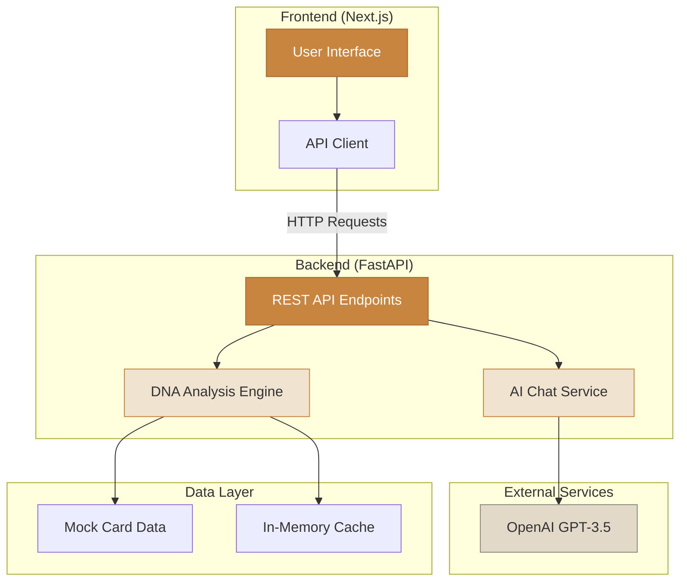
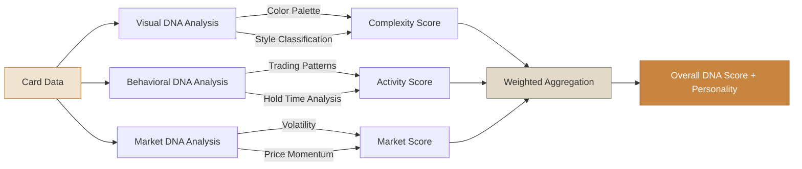

# 🧬 Renaiss Card DNA

**AI-Powered Card Personality & Matching Engine**

> Built for Renaiss Tech Hackathon Season 1

Every card has a soul. Discover yours.

---

## 🎯 What is Card DNA?

Renaiss Card DNA is an AI-powered platform that analyzes collectible cards across three dimensions:

- **Visual DNA**: Color palettes, artistic style, complexity, and mood
- **Behavioral DNA**: Trading patterns, hold times, and collector archetypes  
- **Market DNA**: Volatility, rarity, price momentum, and collection synergy

Unlike traditional tools that only show raw stats, Card DNA reveals the **personality** of each card and matches collectors with cards that fit their vibe.

---

## ✨ Features

### 🤖 **AI Chat Advisor** ⭐ NEW!
Real-time conversational AI powered by OpenAI GPT-3.5:
- Ask questions about any card's DNA and personality
- Get personalized trading strategy advice
- Context-aware responses using card data
- Natural language interface for exploring collections
- **Try it:** `/chat` endpoint

### 🔬 Card Analyzer
Analyze any card to see its complete DNA profile:
- Multi-dimensional personality scoring
- Visual style classification
- Trading behavior patterns
- Market momentum indicators

### 👤 Collector Profiler
Understand your collection's DNA:
- Primary style preferences
- Collector type classification
- Portfolio gap analysis
- Personality traits

### 🎯 Smart Matching
Get personalized card recommendations:
- Match score based on your collection DNA
- Reason-based recommendations
- Strength ratings (strong/moderate/weak)

### 📊 Portfolio Analytics
Visualize your collection with interactive charts:
- Collection value & size metrics
- Style distribution pie charts
- Rarity breakdown analysis
- Complexity score rankings

---

## 🚀 Quick Start

### Prerequisites
- **Backend**: Python 3.9+
- **Frontend**: Node.js 18+

### Backend Setup

```bash
cd backend

# Install dependencies
pip install -r requirements.txt --break-system-packages

# Run server
python main.py

# Server runs on http://localhost:8000
# API docs: http://localhost:8000/docs
```

### Frontend Setup

```bash
cd frontend

# Install dependencies
npm install

# Run development server
npm run dev

# App runs on http://localhost:3000
```

---

## 📊 API Endpoints

### Get All Cards
```http
GET /api/cards
```

### Analyze Card DNA
```http
GET /api/card/{card_id}/dna
```

**Response:**
```json
{
  "card_id": "RNS001",
  "card_name": "Cyber Samurai",
  "visual_dna": {
    "color_palette": ["#FF6B6B", "#4ECDC4"],
    "style": "cyberpunk",
    "complexity_score": 8.5,
    "mood": "intense"
  },
  "behavioral_dna": {
    "collector_type": "long-term investor",
    "trading_velocity": "medium",
    "activity_score": 0.72
  },
  "market_dna": {
    "rarity_tier": "legendary",
    "price_momentum": "bullish",
    "volatility": 0.23
  },
  "overall_score": 8.5,
  "personality_summary": "Intense Cyberpunk aesthetic..."
}
```

### Get Collector Profile
```http
GET /api/collector/{wallet}/profile
```

### Get Recommendations
```http
GET /api/match/{wallet}/recommendations?limit=5
```

### Chat with AI Advisor
```http
POST /api/chat
```

**Request:**
```json
{
  "message": "Tell me about legendary cards",
  "card_id": "RNS001",  // optional
  "context": {}          // optional
}
```

**Response:**
```json
{
  "response": "Legendary cards are the rarest and most sought-after...",
  "card_referenced": "RNS001"
}
```

---

## 🏗️ System Architecture



## 🧠 How It Works

### DNA Analysis Pipeline



### Visual Analysis
- Extracts color palettes from card metadata (3-5 dominant colors)
- Classifies artistic style using keyword matching (cyberpunk, fantasy, nature, etc.)
- Calculates complexity score (0-10) based on color richness and visual traits
- Analyzes mood (intense, calm, mysterious) from style and color combinations

### Behavioral Clustering
- Analyzes trading patterns: hold time (days) and trading velocity (trades/month)
- Groups into collector archetypes: long-term investor, active trader, strategic holder
- Scores activity levels (0-1) based on transaction frequency
- Calculates liquidity rating: high, medium, low

### Market DNA
- Volatility score (0-1) from price fluctuation simulation
- Rarity tier classification: common, rare, epic, legendary
- Price momentum indicators: bullish, neutral, bearish
- Collection synergy tags for portfolio optimization

### Matching Algorithm
```python
match_score = (
    0.4 * visual_similarity +      # Style & complexity match
    0.3 * behavioral_fit +          # Collector type alignment
    0.2 * market_alignment +        # Rarity & momentum fit
    0.1 * social_signals            # Community trends (future)
)
```

### AI Chat Context Injection
```python
# When user asks about a specific card
context = {
    "card_dna": get_card_dna(card_id),
    "user_collection": get_collector_profile(wallet),
    "market_trends": get_recent_trades(card_id)
}

# GPT-3.5 receives enriched prompt with card DNA metrics
ai_response = openai.chat.completions.create(
    model="gpt-3.5-turbo",
    messages=[
        {"role": "system", "content": f"Card DNA: {context}"},
        {"role": "user", "content": user_message}
    ]
)
```

---

## ⚠️ Important Disclaimers

### Data Sources
- **Cards**: Mock dataset (20 sample cards for demo purposes)
- **Transactions**: Synthetic trading history generated for prototype
- **Collector Profiles**: Deterministic generation based on wallet hash

### AI Predictions
- DNA scores are **illustrative** and for exploration only
- Not financial advice or investment recommendations
- Models are prototypes - not production-ready

### Privacy & Safety
- No real wallet data collected
- No blockchain queries performed
- All data is mock/synthetic for demo purposes

**⚠️ DO NOT use this tool for real trading decisions**

---

## 🏗️ Tech Stack

### Backend
- **FastAPI**: Modern Python web framework
- **OpenAI GPT-3.5**: Conversational AI for chat advisor
- **scikit-learn**: Machine learning (clustering, scaling)
- **Pydantic**: Data validation
- **python-dotenv**: Environment variable management

### Frontend
- **Next.js 14**: React framework (App Router)
- **TypeScript**: Type-safe JavaScript
- **Tailwind CSS**: Utility-first styling
- **Axios**: HTTP client
- **Lucide Icons**: Icon library

### Design System
- Warm paper palette (#F6F1E8, #C8853F)
- DM Serif Display + Inter fonts
- Punchy, collector-focused aesthetic

---

## 📁 Project Structure

```
renaiss-card-dna/
├── backend/
│   ├── main.py              # FastAPI application
│   ├── ai_engine.py         # Core DNA analysis logic
│   ├── requirements.txt
│   └── .env                 # API keys (not committed)
├── frontend/
│   ├── app/
│   │   ├── page.tsx         # Home page
│   │   ├── analyzer/        # Card analyzer
│   │   ├── profiler/        # Collector profiler
│   │   ├── portfolio/       # Portfolio analytics
│   │   ├── chat/            # AI Chat Advisor
│   │   └── layout.tsx
│   ├── lib/
│   │   └── api.ts           # API client
│   └── package.json
└── data/
    └── mock_cards.json      # Sample card data
```

---

## 🎨 Design Philosophy

**"Build tools, not decks"** — This is a working demo, not a pitch presentation.

- **Usability First**: Clean, intuitive interfaces
- **Real Functionality**: All features work end-to-end
- **Safety-Conscious**: Clear disclaimers and data labeling
- **Ecosystem Relevant**: Built specifically for Renaiss collector economy

---

## 🔮 Future Enhancements

### Phase 1 (Post-Hackathon)
- [ ] Real blockchain integration (Renaiss Protocol)
- [ ] More sophisticated ML models (image embeddings via CLIP)
- [ ] Social discovery features (find similar collectors)
- [ ] Card comparison tool
- [ ] Multi-language AI chat support
- [ ] Voice-based chat interface

### Phase 2 (Production)
- [ ] Historical price chart integration
- [ ] Portfolio tracking & alerts
- [ ] Community-driven tagging system
- [ ] Mobile app (React Native)
- [ ] AI-powered market trend analysis
- [ ] Personalized notification system

### Phase 3 (Advanced)
- [ ] Predictive analytics (price forecasting)
- [ ] Sentiment analysis from community discussions
- [ ] Automated trading suggestions with AI reasoning
- [ ] DAO governance for model parameters
- [ ] Cross-platform card DNA standard
- [ ] Integration with major NFT marketplaces

---

## 🤝 Contributing

This is a hackathon prototype. Feedback welcome!

**Areas for improvement:**
- More diverse card styles in training data
- Better clustering algorithms for collector types
- Enhanced visual complexity scoring
- Real-time data pipeline integration

---

## 📜 License

MIT License - Built for Renaiss Tech Hackathon S1

---

## 🏆 Hackathon Context

**Renaiss Tech Hackathon Season 1: AI, Game & Tool Sprint**

- **Track**: AI
- **Theme**: Tools for the taste-driven collector economy
- **Duration**: June 28 - July 11, 2026
- **Judging Criteria**:
  - ✅ Usability: Working demo with clear UX
  - ✅ Innovation: First personality-based matching for collectibles
  - ✅ Ecosystem Relevance: Built specifically for Renaiss
  - ✅ Clarity: Well-documented, easy to understand
  - ✅ Safety: Transparent data sources & AI disclaimers

---

## 👨‍💻 Author

Built with ❤️ by **TRAN DANG HOP**

**Contact:**
- X: [@bella_summerss](https://x.com/bella_summerss)
- Discord: tdh8386
- Email: trandanghop2006@gmail.com

---

## 🙏 Acknowledgments

- **Renaiss Team** for organizing the hackathon
- **Benjamin Tong (CTO)** for coaching sessions
- The collector economy community for inspiration

---

**Remember**: This is a prototype for exploration. Always do your own research before making any investment decisions.

🧬 *Every card has a soul. What's yours?*
